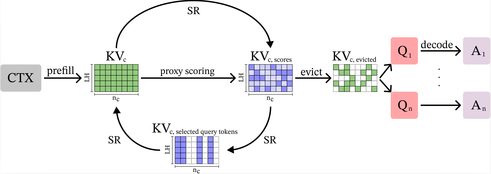
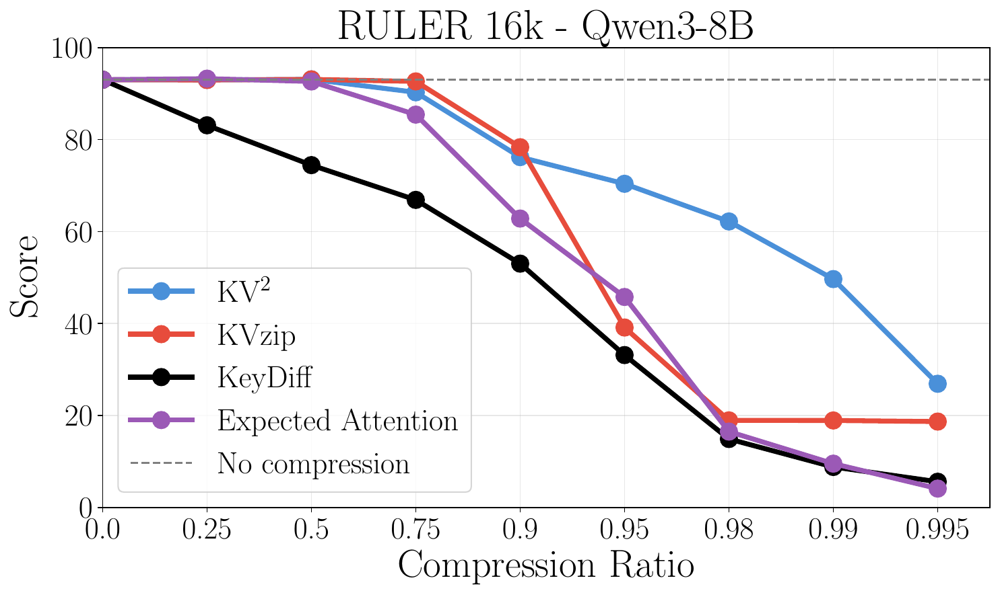

# kvpress

## KV²

`KVSquaredPress` ([source](kvpress/presses/kvsquared_press.py)) implements KV², a query-agnostic reusable KV-cache compression method based on selective reconstruction.



Long-context models are only as useful as the cache they can afford to keep. As prompts grow longer, the key-value (KV) cache quickly becomes the dominant memory cost, especially when one prefilled context must later support many different queries. In this reusable setting, query-agnostic compression faces a core trade-off between cost and quality: lightweight estimators avoid additional passes over the context, while full-context reconstruction scoring can be more robust but expensive because it requires reprocessing the entire context. This thesis introduces KV², a query-agnostic KV-cache compression method based on selective reconstruction. KV² first uses a lightweight proxy scorer to identify informative in-context tokens and then reprocesses only this subset to compute final eviction scores. It therefore retains the main benefit of context-reconstruction scoring while avoiding the cost of reprocessing the full context. The same design also supports iterative self-refinement, where one reconstruction pass provides the proposal signal for the next. Experiments on RULER, Needle-in-a-Haystack, LongBench, and InfiniteBench show that KV² is strongest exactly where reusable compression becomes hardest: under severe budgets. On RULER 16K at 2% KV size, KV² improves the average score over the next-best baseline by more than 40 percentage points. On LongBench, it achieves the best average results across tight 2%-10% budgets on both Llama-3.1-8B-Instruct and Qwen3-8B, while remaining competitive on 200K-scale InfiniteBench. Single-pass KV² also reduces compression-stage runtime and peak memory relative to full-context reconstruction, making it the strongest practical default configuration. These results show that reusable KV-cache compression does not require reprocessing everything: a small, well-chosen set of reconstruction targets is often enough to preserve most of the useful signal while keeping long-context inference practical.

KV² defaults to `KeyDiffPress` as its lightweight proxy scorer and also supports iterative self-refinement by nesting `KVSquaredPress` inside itself.

<p align="center">
  
</p>

## Using This Contribution

`KVSquaredPress` is available from the top-level package and can be used through the existing `kv-press-text-generation` pipeline:

```python
from transformers import pipeline
from kvpress import KVSquaredPress

model = "Qwen/Qwen3-8B"
pipe = pipeline("kv-press-text-generation", model=model, device_map="auto", dtype="auto")

context = "A very long text you want to compress once and reuse"
question = "\nWhat are the key facts in the context?"

press = KVSquaredPress(compression_ratio=0.9, chunk_size=4096)
answer = pipe(context, question=question, press=press)["answer"]
```

## Implementation Notes

- Implementation: `kvpress/presses/kvsquared_press.py`
- Supporting KVzip changes: `kvpress/presses/kvzip_press.py`

## Minimal Setup

```bash
git clone https://github.com/NVIDIA/kvpress.git
cd kvpress
uv sync
```

For the repository contribution flow, see [CONTRIBUTING.md](CONTRIBUTING.md) and [AGENTS.md](AGENTS.md).

## Citation

If you use KVPress in your research, please cite:

```bibtex
@article{devoto2025expectedattention,
  title={Expected Attention: KV Cache Compression by Estimating Attention from Future Queries Distribution},
  author={Devoto, Alessio and Jeblick, Maximilian and J{\'e}gou, Simon},
  journal={arXiv preprint arXiv:2510.00636},
  year={2025},
  url={https://arxiv.org/abs/2510.00636}
}
```
